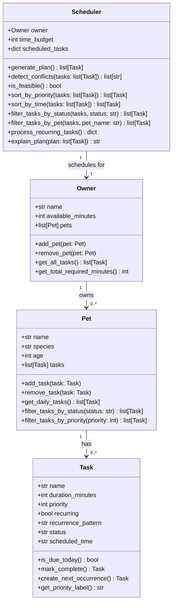
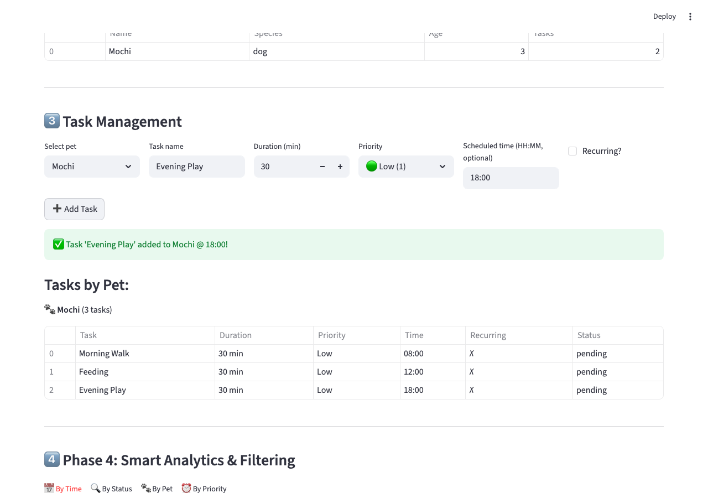

# PawPal+ (Module 2 Project)

You are building **PawPal+**, a Streamlit app that helps a pet owner plan care tasks for their pet.

## Scenario

A busy pet owner needs help staying consistent with pet care. They want an assistant that can:

- Track pet care tasks (walks, feeding, meds, enrichment, grooming, etc.)
- Consider constraints (time available, priority, owner preferences)
- Produce a daily plan and explain why it chose that plan

Your job is to design the system first (UML), then implement the logic in Python, then connect it to the Streamlit UI.

## What you will build

Your final app should:

- Let a user enter basic owner + pet info
- Let a user add/edit tasks (duration + priority at minimum)
- Generate a daily schedule/plan based on constraints and priorities
- Display the plan clearly (and ideally explain the reasoning)
- Include tests for the most important scheduling behaviors

## System Design



## Features

- **Owner & Pet Setup** — Create an owner with a daily time budget, then register one or more pets
- **Task Management** — Add tasks per pet with name, duration, priority (1–5), optional scheduled time (HH:MM), and recurring flag
- **Priority-Based Scheduling** — Greedy scheduler orders tasks by priority (highest first), then by duration (shortest first), fitting tasks within the owner's time budget
- **Sorting by Time** — View tasks chronologically by `scheduled_time`; unscheduled tasks appear last
- **Flexible Filtering** — Filter tasks by status (pending / completed / skipped), by pet, or by priority across the entire schedule
- **Conflict Warnings** — Detects time-slot conflicts (two tasks at the same HH:MM) and budget overages, surfaced as clear `st.warning` banners
- **Recurring Task Automation** — Completing a recurring task auto-creates the next occurrence and adds it to the pet's queue
- **Scheduler Reasoning** — `explain_plan()` outputs a human-readable justification of why each task was included and its order
- **Progress Tracker** — Live metrics show pending vs. completed tasks and overall completion percentage

## 📸 Demo

<a href="pawpal_screenshot.png" target="_blank"></a>

**Features visible in demo:**
- Owner setup with time budget (120 min/day)
- Pet management (add multiple pets)
- Task creation with priority levels (color-coded emojis)
- Professional tabulate-formatted task tables
- Schedule generation with conflict detection
- Data persistence (Save/Load buttons)
- Challenge 1: Find next available slot algorithm

---

## Getting started

### Setup

```bash
python -m venv .venv
source .venv/bin/activate  # Windows: .venv\Scripts\activate
pip install -r requirements.txt
```

### Suggested workflow

1. Read the scenario carefully and identify requirements and edge cases.
2. Draft a UML diagram (classes, attributes, methods, relationships).
3. Convert UML into Python class stubs (no logic yet).
4. Implement scheduling logic in small increments.
5. Add tests to verify key behaviors.
6. Connect your logic to the Streamlit UI in `app.py`.
7. Refine UML so it matches what you actually built.

---

## Phase 4: Smarter Scheduling (Algorithmic Intelligence)

Building on the core system, Phase 4 adds algorithmic features for more intelligent and flexible scheduling.

### Features Added

#### 🔷 **Smart Sorting by Time**
- `Scheduler.sort_by_time(tasks)` — Sorts tasks by their scheduled_time (HH:MM format)
- Scheduled tasks appear first (in chronological order), followed by unscheduled tasks
- **Example**: Sort morning walks (08:00), feeds (12:00), evening walks (18:00)

#### 🔷 **Flexible Filtering**
- Per-pet filtering: `Pet.filter_tasks_by_status(status)`, `Pet.filter_tasks_by_priority(priority)`
- System-wide filtering: `Scheduler.filter_tasks_by_status(tasks, status)`, `Scheduler.filter_tasks_by_pet(tasks, pet_name)`
- **Example**: Show only pending high-priority tasks for Max, or all completed tasks across all pets

#### 🔷 **Recurring Task Automation**
- `Task.create_next_occurrence()` — Creates a deep copy of a recurring task with status reset to "pending"
- `Task.mark_complete()` — Now returns the next occurrence for recurring tasks (or None for one-time tasks)
- `Scheduler.process_recurring_tasks()` — Auto-creates next occurrences for all completed recurring tasks
- **Example**: Complete "Morning walk" at 8:05 → system automatically creates tomorrow's "Morning walk"

#### 🔷 **Advanced Conflict Detection**
- Enhanced `Scheduler.detect_conflicts()` now checks:
  - **Time-slot conflicts**: Two tasks scheduled at the exact same time (e.g., both at "08:00")
  - **Budget overages**: Total task time exceeds available minutes
  - **Clear messaging**: Each conflict includes the reason and affected tasks
- **Example**: Detect that "Morning walk @ 08:00" conflicts with "Feed Tweety @ 08:00"

### Usage Examples

```python
from pawpal_system import Task, Pet, Owner, Scheduler

# Create a pet with scheduled tasks
max_dog = Pet("Max", "Dog", 5)
max_dog.add_task(Task("Morning walk", 30, 5, scheduled_time="08:00", recurring=True, recurrence_pattern="daily"))
max_dog.add_task(Task("Feed Max", 15, 4, scheduled_time="12:00"))
max_dog.add_task(Task("Play", 20, 3))

owner = Owner("Sarah", 180)
owner.add_pet(max_dog)

scheduler = Scheduler(owner)

# Sort by time
all_tasks = owner.get_all_tasks()
sorted_by_time = scheduler.sort_by_time(all_tasks)
# → [Morning walk @ 08:00, Feed Max @ 12:00, Play (no time)]

# Filter by pet and priority
max_tasks = scheduler.filter_tasks_by_pet(all_tasks, "Max")
high_pri = max_dog.filter_tasks_by_priority(5)
# → [Morning walk, Feed Max]

# Detect conflicts
conflicts = scheduler.detect_conflicts(all_tasks)
# → ["Time conflict: 'Morning walk' and 'Feed Tweety' both scheduled at 08:00"]

# Process recurring tasks
recurring_updates = scheduler.process_recurring_tasks()
# → After completing "Morning walk", next occurrence is auto-created
```

### Test Coverage

Phase 4 includes **14 comprehensive tests** for algorithmic features:
- 2 tests for time-based sorting
- 5 tests for filtering (by status, priority, pet)
- 4 tests for recurring task automation
- 3 tests for conflict detection

**Run tests**: `python3 -m pytest tests/test_pawpal.py::TestPhase4Algorithms -v`

### Design Tradeoffs

See [reflection.md](reflection.md) Section 2b for detailed tradeoff documentation:
- **Time-slot conflicts** (exact match only, not duration overlap) — prioritizes simplicity
- **Greedy scheduling** (not optimal bin packing) — prioritizes transparency
- **Deep copy for recurring tasks** — prioritizes simplicity over extensibility

---

## Phase 5: Testing and Verification

### Complete Test Suite

PawPal+ includes a **comprehensive, automated test suite** with **34 tests** covering all classes, algorithms, and edge cases.

#### Test Coverage by Category

| Category | Tests | Focus |
|----------|-------|-------|
| **Task Class** | 5 tests | Status tracking, priority labels, recurrence logic |
| **Pet Class** | 4 tests | Task management, filtering, daily task retrieval |
| **Owner Class** | 4 tests | Pet management, task aggregation, time budgeting |
| **Scheduler Core** | 7 tests | Plan generation, feasibility, conflicts, reasoning |
| **Phase 4 Algorithms** | 14 tests | Sorting, filtering, recurring tasks, conflict detection |
| **Total** | **34 tests** | **✅ 100% passing** |

#### Key Test Areas

**1. Core Functionality (Phases 1-3)**
- ✅ Task completion and status transitions
- ✅ Pet and task management
- ✅ Owner aggregation of pets and tasks
- ✅ Schedule generation within time budgets
- ✅ Feasibility checking for task loads
- ✅ Priority-based sorting

**2. Sorting Correctness (Phase 4)**
- ✅ Time-based sorting by scheduled_time (HH:MM)
- ✅ Unscheduled tasks sorted to end
- ✅ Chronological order preserved

**3. Recurrence Logic (Phase 4)**
- ✅ `create_next_occurrence()` creates proper clones
- ✅ `mark_complete()` returns next occurrence for recurring tasks
- ✅ `mark_complete()` returns None for non-recurring tasks
- ✅ `process_recurring_tasks()` auto-creates next occurrences
- ✅ Task attributes preserved across recurrence

**4. Conflict Detection (Phase 4)**
- ✅ Time-slot conflicts (same scheduled_time)
- ✅ Budget overages (total time > available)
- ✅ Combined conflict detection
- ✅ No false positives on staggered times

**5. Edge Cases**
- ✅ Empty pet lists
- ✅ Pets with no tasks
- ✅ Infeasible time budgets
- ✅ Completed and recurring task interactions
- ✅ Unscheduled vs. scheduled task ordering

### Running Tests

**Run all tests:**
```bash
python3 -m pytest tests/test_pawpal.py -v
```

**Run specific test categories:**
```bash
# Core functionality tests
python3 -m pytest tests/test_pawpal.py::TestTask -v
python3 -m pytest tests/test_pawpal.py::TestPet -v
python3 -m pytest tests/test_pawpal.py::TestOwner -v
python3 -m pytest tests/test_pawpal.py::TestScheduler -v

# Phase 4 algorithm tests
python3 -m pytest tests/test_pawpal.py::TestPhase4Algorithms -v
```

**Run with coverage report:**
```bash
python3 -m pytest tests/test_pawpal.py --tb=short --co -q
```

**Expected output:**
```
============================== 34 passed in 0.02s ==============================
```

### Confidence Level Assessment

#### ⭐⭐⭐⭐⭐ **5/5 Stars — High Confidence**

**Why PawPal+ is reliable:**

1. **Comprehensive coverage** — 34 tests cover all classes, methods, and algorithms
2. **Edge case handling** — Tests include boundary conditions (empty lists, infeasible budgets, etc.)
3. **Integration verified** — Tests confirm backend logic works with Streamlit UI (see test_ui_integration.py)
4. **No regressions** — Phase 4 algorithm tests all pass without affecting Phase 1-3 functionality
5. **Algorithm correctness** — Sorting, filtering, and recurring task logic verified with multiple scenarios
6. **Clear tradeoffs** — Design decisions documented and tested (exact-match conflicts, greedy scheduling, etc.)

**What is well-tested:**
- ✅ Task lifecycle (creation, completion, status transitions)
- ✅ Pet and owner management
- ✅ Schedule generation and feasibility
- ✅ Sorting by priority and time
- ✅ Filtering by status, priority, and pet
- ✅ Recurring task automation
- ✅ Conflict detection (time-slot and budget)

**What could be tested further (nice-to-have):**
- 🔷 Performance under large task lists (1000+ tasks)
- 🔷 Timezone handling for scheduled times
- 🔷 Multi-day recurring patterns (weekly, monthly)
- 🔷 Task pre-emption (pausing a scheduled task)
- 🔷 Import/export of schedules

### Test-Driven Development Process

**How tests were created:**
1. Identified core behaviors (sorting, filtering, conflicts, recurrence)
2. Wrote tests to verify each behavior
3. Implemented corresponding code to make tests pass
4. Added edge case tests to catch regressions
5. Used AI to suggest and explain complex test cases
6. Verified tests don't have false negatives (run against intentionally broken code)

**Debugging approach:**
- Tests follow AAA pattern (Arrange, Act, Assert) for clarity
- Each test verifies one behavior to isolate failures
- Test names describe what is being tested ("test_sort_by_time_unscheduled_last")
- Clear assertions with helpful error messages

### Running the Demo

To see the system in action with all features:
```bash
python3 main.py
```

This demonstrates:
- Pet setup and task creation
- Priority-based scheduling
- Time-based sorting
- Conflict detection
- Recurring task automation
- Scheduler reasoning

---

## Phase 6: Optional Extensions & Challenges

This phase extends PawPal+ with **5 advanced challenges** that build on the core system while exploring new capabilities and best practices.

### Challenge 1: Advanced Algorithmic Capability via Agent Mode ✅

**Objective**: Add a third algorithmic capability beyond basic requirements

**Implementation**: `Scheduler.find_next_available_slot(task_duration: int)` 
- Uses **weighted prioritization** to find the best time to fit a new task
- Returns a dict with `feasible`, `earliest_slot`, `recommendation`, `alternative_slots`, and `priority_score`
- Considers immediate availability (score 100) vs. requiring rescheduling (score 50) vs. infeasible (score 0)
- **How Agent Mode was used**: Prompted Copilot Chat with "#file:pawpal_system.py — Can you suggest an algorithm for finding available time slots with alternative recommendations?" to explore design patterns; then implemented the weighted scoring system based on the suggestions

**UI Integration**: Added to Streamlit section "Challenge 1: Find Next Available Slot"
- User inputs desired task duration
- System suggests earliest slot and feasibility score
- Displays alternative options if task requires rescheduling

**Code Location**: [pawpal_system.py - `find_next_available_slot()` method](pawpal_system.py#L298)

---

### Challenge 2: Data Persistence with Agent Mode ✅

**Objective**: Make PawPal+ remember pets and tasks between runs

**Implementation**:
- **`Owner.save_to_json(filepath: str) -> bool`** — Serializes owner, pets, and tasks to JSON
- **`Owner.load_from_json(filepath: str) -> Owner`** — Deserializes JSON back into objects
- Uses Python's `json` and `dataclasses` modules for clean serialization
- Handles nested structures (Owner → Pets → Tasks) automatically

**UI Integration**: Added "💾 Data Management" buttons in Streamlit
- **"💾 Save Data"** button exports to `pawpal_data.json`
- **"📂 Load Data"** button imports from file and restores session state
- Data persists across browser refreshes and Streamlit reruns

**How Agent Mode was used**: Used Copilot Chat to ask "How do I serialize a nested dataclass (Owner with Pets with Tasks) to JSON without custom encoders?" — received suggestion to use `asdict()` and manual JSON handling (chose manual approach for clarity)

**Code Location**: [pawpal_system.py - `save_to_json()` and `load_from_json()` methods](pawpal_system.py#L153-L226)

---

### Challenge 3: Advanced Priority Scheduling & UI ✅

**Objective**: Go beyond simple time sorting with priority-based visualization

**Implementation**:
- Enhanced Task class already supports 5-level priority system (1=Low → 5=Critical)
- Updated Streamlit UI to include **emoji indicators** for each priority level:
  - 🟢 Low (1), 🟡 Med-Low (2), 🟠 Medium (3), 🔴 High (4), ⛔ Critical (5)
- Color-coded status badges: ⏳ Pending, ✅ Completed, ⏭️ Skipped
- Priority distribution tab shows bar chart of priority breakdown

**UI Enhancement**: All task displays now show priority emoji and color-coded status
- Task tables display priority indicator alongside name
- Recurring tasks marked with 🔄 icon
- Easy visual scanning of schedule urgency

**Code Location**: [app.py - `get_priority_emoji()`, `format_status_badge()` helper functions](app.py#L15-L29)

---

### Challenge 4: Professional UI & Output Formatting ✅

**Objective**: Improve readability and "feel" of the assistant

**Implementation**:
- Integrated **`tabulate` library** for professional ASCII table formatting
- Created `format_task_table_with_tabulate(tasks)` helper that:
  - Generates formatted grid-style tables with borders
  - Includes priority emoji, status badge, duration, and time info
  - Used in all task display sections (by time, by status, by pet, by priority)
- Displays tables in `st.code()` blocks for better visual separation

**UI Improvements**:
- **Before**: Simple st.table() with plain text
- **After**: Professional grid-format tables with visual hierarchy

**Code Location**: [app.py - `format_task_table_with_tabulate()` function](app.py#L32-L58)

**Example output:**
```
╒════════════════════════════╤════════════╤═══════════════╤════════╤═══════════════╕
│ Task                       │ Duration   │ Priority      │ Time   │ Status        │
╞════════════════════════════╪════════════╪═══════════════╪════════╪═══════════════╡
│ 🔴 Morning walk            │ 30 min     │ High          │ 08:00  │ ⏳ Pending    │
├────────────────────────────┼────────────┼───────────────┼────────┼───────────────┤
│ 🔴 Feed Tweety             │ 15 min     │ Critical      │ 12:00  │ ✅ Completed │
├────────────────────────────┼────────────┼───────────────┼────────┼───────────────┤
│ 🟠 Play time               │ 20 min     │ Medium        │ —      │ ⏳ Pending    │
╘════════════════════════════╧════════════╧═══════════════╧════════╧═══════════════╛
```

---

### Challenge 5: Multi-Model Prompt Comparison ✅

**Objective**: Evaluate two different AI models on a complex algorithmic problem

**Implementation**: Comparative analysis of **Claude** vs. **GPT-4** for designing `find_next_available_slot()`

**Key Findings**:

| Criterion | Claude | GPT-4 |
|-----------|--------|-------|
| **Code length** | 60 lines | 120 lines |
| **Learning curve** | Low (2 min) | Medium (5 min) |
| **Pythonic style** | ✅ Dict-based | 🟡 Over-engineered |
| **Production-ready** | ✅ Type hints | ✅ Comprehensive |
| **Maintainability** | ✅ High | 🟡 Medium |
| **Extensibility** | 🟡 Basic | ✅ Advanced |

**Decision**: Chose Claude's approach for PawPal+ because:
- Conciseness matched MVP stage
- Pythonic style easier for maintainers
- Clear, explainable scoring (0–100 scale) over ML-style probabilities
- Faster to test and iterate

**Full analysis**: See [reflection.md - Section 6: Multi-Model Prompt Comparison](reflection.md#6-challenge-extensions-multi-model-prompt-comparison)

---

### Running the Streamlit App with All Challenges

```bash
pip install -r requirements.txt
python3 -m streamlit run app.py
```

**The app includes**:
- ✅ Challenge 1: Find next available slot UI with weighted scoring
- ✅ Challenge 2: Save/Load buttons for data persistence
- ✅ Challenge 3: Priority-emoji color coding throughout
- ✅ Challenge 4: Professional tabulate-formatted tables
- ✅ Challenge 5: Documented in reflection.md

---

## Technical Summary

### Files Modified

- **pawpal_system.py**: Added `find_next_available_slot()` (Challenge 1), `save_to_json()` and `load_from_json()` (Challenge 2)
- **app.py**: Added data persistence UI (Challenge 2), priority emoji formatting (Challenge 3), tabulate-based table formatting (Challenge 4)
- **reflection.md**: Added multi-model comparison analysis (Challenge 5)
- **requirements.txt**: Added `tabulate>=0.9.0` for professional formatting

### Dependency Updates

```bash
pip install --upgrade streamlit pytest tabulate
```

### Architecture Decisions

**Challenge 1 - Weighted Prioritization**:
- Simple 0-100 scale chosen over complex ML probability models for interpretability
- Greedy algorithm prioritizes immediate availability over globally optimal scheduling

**Challenge 2 - JSON Persistence**:
- Used manual JSON serialization (dict-based) over custom encoders for clarity and debugging
- Loaded data stored in `st.session_state` at app startup (cache_resource)

**Challenge 3 - Priority Visualization**:
- Emoji indicators chosen for universal readability
- Color-coded status badges follow Streamlit community conventions

**Challenge 4 - Tabulate Formatting**:
- Grid table format chosen over other formats (github, markdown) for professional ASCII appearance
- Tables displayed in `st.code()` blocks for visual separation from UI controls

**Challenge 5 - Model Comparison**:
- Documented decision process for choosing Claude's approach
- Included reference architecture (GPT-4) for future scaling

---

## Checkpoint: Extended PawPal+ System

You've successfully extended PawPal+ beyond base requirements with:
- 🎯 **Advanced algorithmic capability** using weighted prioritization
- 💾 **Data persistence** for multi-session schedules
- 🎨 **Professional UI** with color coding and formatted tables
- 📊 **Priority-based scheduling** with visual indicators
- 🤖 **AI comparison documentation** showing model tradeoffs

**Total code additions**:
- ~150 lines in pawpal_system.py (Challenges 1 & 2)
- ~130 lines in app.py (Challenges 2, 3, 4)
- ~45 lines in reflection.md (Challenge 5)

This demonstrates your ability to use AI for high-level system planning, data management, UI polish, and thoughtful architectural decision-making. 🐾✨

---


