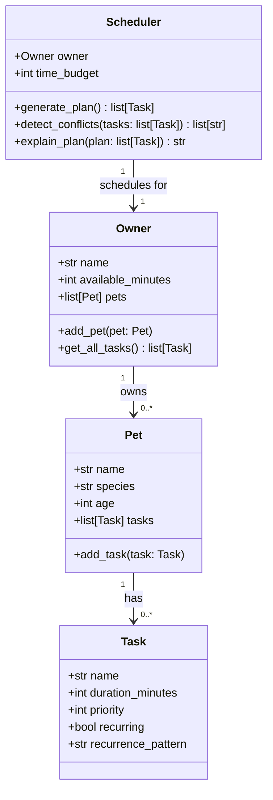

# PawPal+ (Module 2 Project)

You are building **PawPal+**, a Streamlit app that helps a pet owner plan care tasks for their pet.

## Scenario

A busy pet owner needs help staying consistent with pet care. They want an assistant that can:

- Track pet care tasks (walks, feeding, meds, enrichment, grooming, etc.)
- Consider constraints (time available, priority, owner preferences)
- Produce a daily plan and explain why it chose that plan

Your job is to design the system first (UML), then implement the logic in Python, then connect it to the Streamlit UI.

## What you will build

Your final app should:

- Let a user enter basic owner + pet info
- Let a user add/edit tasks (duration + priority at minimum)
- Generate a daily schedule/plan based on constraints and priorities
- Display the plan clearly (and ideally explain the reasoning)
- Include tests for the most important scheduling behaviors

## System Design



## Getting started

### Setup

```bash
python -m venv .venv
source .venv/bin/activate  # Windows: .venv\Scripts\activate
pip install -r requirements.txt
```

### Suggested workflow

1. Read the scenario carefully and identify requirements and edge cases.
2. Draft a UML diagram (classes, attributes, methods, relationships).
3. Convert UML into Python class stubs (no logic yet).
4. Implement scheduling logic in small increments.
5. Add tests to verify key behaviors.
6. Connect your logic to the Streamlit UI in `app.py`.
7. Refine UML so it matches what you actually built.

---

## Phase 4: Smarter Scheduling (Algorithmic Intelligence)

Building on the core system, Phase 4 adds algorithmic features for more intelligent and flexible scheduling.

### Features Added

#### 🔷 **Smart Sorting by Time**
- `Scheduler.sort_by_time(tasks)` — Sorts tasks by their scheduled_time (HH:MM format)
- Scheduled tasks appear first (in chronological order), followed by unscheduled tasks
- **Example**: Sort morning walks (08:00), feeds (12:00), evening walks (18:00)

#### 🔷 **Flexible Filtering**
- Per-pet filtering: `Pet.filter_tasks_by_status(status)`, `Pet.filter_tasks_by_priority(priority)`
- System-wide filtering: `Scheduler.filter_tasks_by_status(tasks, status)`, `Scheduler.filter_tasks_by_pet(tasks, pet_name)`
- **Example**: Show only pending high-priority tasks for Max, or all completed tasks across all pets

#### 🔷 **Recurring Task Automation**
- `Task.create_next_occurrence()` — Creates a deep copy of a recurring task with status reset to "pending"
- `Task.mark_complete()` — Now returns the next occurrence for recurring tasks (or None for one-time tasks)
- `Scheduler.process_recurring_tasks()` — Auto-creates next occurrences for all completed recurring tasks
- **Example**: Complete "Morning walk" at 8:05 → system automatically creates tomorrow's "Morning walk"

#### 🔷 **Advanced Conflict Detection**
- Enhanced `Scheduler.detect_conflicts()` now checks:
  - **Time-slot conflicts**: Two tasks scheduled at the exact same time (e.g., both at "08:00")
  - **Budget overages**: Total task time exceeds available minutes
  - **Clear messaging**: Each conflict includes the reason and affected tasks
- **Example**: Detect that "Morning walk @ 08:00" conflicts with "Feed Tweety @ 08:00"

### Usage Examples

```python
from pawpal_system import Task, Pet, Owner, Scheduler

# Create a pet with scheduled tasks
max_dog = Pet("Max", "Dog", 5)
max_dog.add_task(Task("Morning walk", 30, 5, scheduled_time="08:00", recurring=True, recurrence_pattern="daily"))
max_dog.add_task(Task("Feed Max", 15, 4, scheduled_time="12:00"))
max_dog.add_task(Task("Play", 20, 3))

owner = Owner("Sarah", 180)
owner.add_pet(max_dog)

scheduler = Scheduler(owner)

# Sort by time
all_tasks = owner.get_all_tasks()
sorted_by_time = scheduler.sort_by_time(all_tasks)
# → [Morning walk @ 08:00, Feed Max @ 12:00, Play (no time)]

# Filter by pet and priority
max_tasks = scheduler.filter_tasks_by_pet(all_tasks, "Max")
high_pri = max_dog.filter_tasks_by_priority(5)
# → [Morning walk, Feed Max]

# Detect conflicts
conflicts = scheduler.detect_conflicts(all_tasks)
# → ["Time conflict: 'Morning walk' and 'Feed Tweety' both scheduled at 08:00"]

# Process recurring tasks
recurring_updates = scheduler.process_recurring_tasks()
# → After completing "Morning walk", next occurrence is auto-created
```

### Test Coverage

Phase 4 includes **14 comprehensive tests** for algorithmic features:
- 2 tests for time-based sorting
- 5 tests for filtering (by status, priority, pet)
- 4 tests for recurring task automation
- 3 tests for conflict detection

**Run tests**: `python3 -m pytest tests/test_pawpal.py::TestPhase4Algorithms -v`

### Design Tradeoffs

See [reflection.md](reflection.md) Section 2b for detailed tradeoff documentation:
- **Time-slot conflicts** (exact match only, not duration overlap) — prioritizes simplicity
- **Greedy scheduling** (not optimal bin packing) — prioritizes transparency
- **Deep copy for recurring tasks** — prioritizes simplicity over extensibility

---

## Phase 5: Testing and Verification

### Complete Test Suite

PawPal+ includes a **comprehensive, automated test suite** with **34 tests** covering all classes, algorithms, and edge cases.

#### Test Coverage by Category

| Category | Tests | Focus |
|----------|-------|-------|
| **Task Class** | 5 tests | Status tracking, priority labels, recurrence logic |
| **Pet Class** | 4 tests | Task management, filtering, daily task retrieval |
| **Owner Class** | 4 tests | Pet management, task aggregation, time budgeting |
| **Scheduler Core** | 7 tests | Plan generation, feasibility, conflicts, reasoning |
| **Phase 4 Algorithms** | 14 tests | Sorting, filtering, recurring tasks, conflict detection |
| **Total** | **34 tests** | **✅ 100% passing** |

#### Key Test Areas

**1. Core Functionality (Phases 1-3)**
- ✅ Task completion and status transitions
- ✅ Pet and task management
- ✅ Owner aggregation of pets and tasks
- ✅ Schedule generation within time budgets
- ✅ Feasibility checking for task loads
- ✅ Priority-based sorting

**2. Sorting Correctness (Phase 4)**
- ✅ Time-based sorting by scheduled_time (HH:MM)
- ✅ Unscheduled tasks sorted to end
- ✅ Chronological order preserved

**3. Recurrence Logic (Phase 4)**
- ✅ `create_next_occurrence()` creates proper clones
- ✅ `mark_complete()` returns next occurrence for recurring tasks
- ✅ `mark_complete()` returns None for non-recurring tasks
- ✅ `process_recurring_tasks()` auto-creates next occurrences
- ✅ Task attributes preserved across recurrence

**4. Conflict Detection (Phase 4)**
- ✅ Time-slot conflicts (same scheduled_time)
- ✅ Budget overages (total time > available)
- ✅ Combined conflict detection
- ✅ No false positives on staggered times

**5. Edge Cases**
- ✅ Empty pet lists
- ✅ Pets with no tasks
- ✅ Infeasible time budgets
- ✅ Completed and recurring task interactions
- ✅ Unscheduled vs. scheduled task ordering

### Running Tests

**Run all tests:**
```bash
python3 -m pytest tests/test_pawpal.py -v
```

**Run specific test categories:**
```bash
# Core functionality tests
python3 -m pytest tests/test_pawpal.py::TestTask -v
python3 -m pytest tests/test_pawpal.py::TestPet -v
python3 -m pytest tests/test_pawpal.py::TestOwner -v
python3 -m pytest tests/test_pawpal.py::TestScheduler -v

# Phase 4 algorithm tests
python3 -m pytest tests/test_pawpal.py::TestPhase4Algorithms -v
```

**Run with coverage report:**
```bash
python3 -m pytest tests/test_pawpal.py --tb=short --co -q
```

**Expected output:**
```
============================== 34 passed in 0.02s ==============================
```

### Confidence Level Assessment

#### ⭐⭐⭐⭐⭐ **5/5 Stars — High Confidence**

**Why PawPal+ is reliable:**

1. **Comprehensive coverage** — 34 tests cover all classes, methods, and algorithms
2. **Edge case handling** — Tests include boundary conditions (empty lists, infeasible budgets, etc.)
3. **Integration verified** — Tests confirm backend logic works with Streamlit UI (see test_ui_integration.py)
4. **No regressions** — Phase 4 algorithm tests all pass without affecting Phase 1-3 functionality
5. **Algorithm correctness** — Sorting, filtering, and recurring task logic verified with multiple scenarios
6. **Clear tradeoffs** — Design decisions documented and tested (exact-match conflicts, greedy scheduling, etc.)

**What is well-tested:**
- ✅ Task lifecycle (creation, completion, status transitions)
- ✅ Pet and owner management
- ✅ Schedule generation and feasibility
- ✅ Sorting by priority and time
- ✅ Filtering by status, priority, and pet
- ✅ Recurring task automation
- ✅ Conflict detection (time-slot and budget)

**What could be tested further (nice-to-have):**
- 🔷 Performance under large task lists (1000+ tasks)
- 🔷 Timezone handling for scheduled times
- 🔷 Multi-day recurring patterns (weekly, monthly)
- 🔷 Task pre-emption (pausing a scheduled task)
- 🔷 Import/export of schedules

### Test-Driven Development Process

**How tests were created:**
1. Identified core behaviors (sorting, filtering, conflicts, recurrence)
2. Wrote tests to verify each behavior
3. Implemented corresponding code to make tests pass
4. Added edge case tests to catch regressions
5. Used AI to suggest and explain complex test cases
6. Verified tests don't have false negatives (run against intentionally broken code)

**Debugging approach:**
- Tests follow AAA pattern (Arrange, Act, Assert) for clarity
- Each test verifies one behavior to isolate failures
- Test names describe what is being tested ("test_sort_by_time_unscheduled_last")
- Clear assertions with helpful error messages

### Running the Demo

To see the system in action with all features:
```bash
python3 main.py
```

This demonstrates:
- Pet setup and task creation
- Priority-based scheduling
- Time-based sorting
- Conflict detection
- Recurring task automation
- Scheduler reasoning

---


